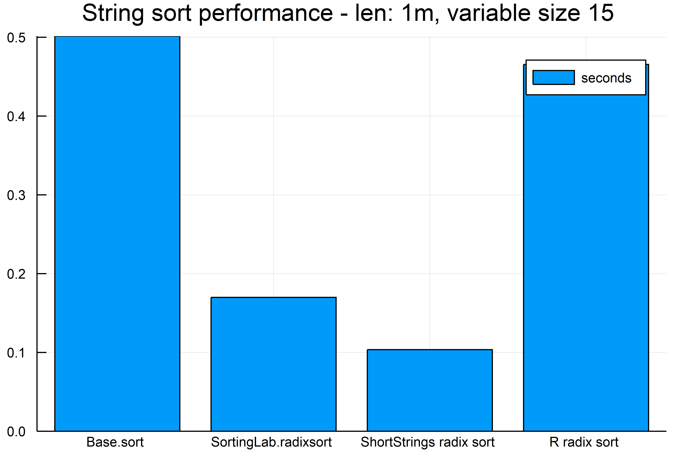

# ShortStrings
This is an efficient string format for storing strings of size less than 15 bytes. 

# Quick Start
```julia
using SortingLab, ShortStrings, SortingAlgorithms
N = Int(1e6)
svec = [randstring(rand(1:15)) for i=1:N]
# convert to ShortString
ssvec = ShortString.(svec)
@time sort(svec);
@time sort(ssvec, by = x->x.size_content, alg=RadixSort);
```

# Benchmark



## Benchmarking code
```julia
# short be
using SortingLab, ShortStrings, SortingAlgorithms, BenchmarkTools;
N = Int(1e6);
svec = [randstring(rand(1:15)) for i=1:N];
# convert to ShortString
ssvec = ShortString.(svec);
basesort = @benchmark sort($svec)
radixsort_timings = @benchmark SortingLab.radixsort($svec)
short_radixsort = @benchmark sort($ssvec, by = x->x.size_content, alg=RadixSort)

using RCall

@rput svec;
r_timings = R"""
replicate($(length(short_radixsort.times)), system.time(sort(svec, method="radix"))[3])
""";

using Plots
bar(["Base.sort","SortingLab.radixsort","ShortStrings radix sort", "R radix sort"],
    mean.([basesort.times./1e9, radixsort_timings.times./1e9, short_radixsort.times./1e9, r_timings]),
    title="String sort performance - len: 1m, variable size 15",
    label = "seconds")
savefig("readme_string_sort.png")


# short be
using SortingLab, ShortStrings, SortingAlgorithms, BenchmarkTools;
N = Int(2e7);
svec = rand([randstring(rand(1:15)) for i=1:N÷100],N)
# convert to ShortString
ssvec = ShortString.(svec);
basesort = @benchmark sort($svec) samples = 5 seconds = 120
radixsort_timings = @benchmark SortingLab.radixsort($svec) samples = 5 seconds = 120
short_radixsort = @benchmark sort($ssvec, by = x->x.size_content, alg=RadixSort) samples = 5 seconds = 120

using RCall

@rput svec;
r_timings = R"""
replicate(max(5, $(length(short_radixsort.times))), system.time(sort(svec, method="radix"))[3])
""";

using Plots
bar(["Base.sort","SortingLab.radixsort","ShortStrings radix sort", "R radix sort"],
    mean.([basesort.times./1e9, radixsort_timings.times./1e9, short_radixsort.times./1e9, r_timings]),
    title="String sort performance - len: $(N÷1_000_000)m, fixed size: 15",
    label = "seconds")
savefig("readme_string_sort_fixed_len.png")
```

# Notes
This is based on the discussion [here](https://discourse.julialang.org/t/progress-towards-faster-sortperm-for-strings/8505/4?u=xiaodai). If Base adopts the hybrid representation of strings then it makes this package redundant.

# Build Status

[](https://travis-ci.org/xiaodaigh/ShortStrings.jl)

[](https://coveralls.io/github/xiaodaigh/ShortStrings.jl?branch=master)

[](http://codecov.io/github/xiaodaigh/ShortStrings.jl?branch=master)
