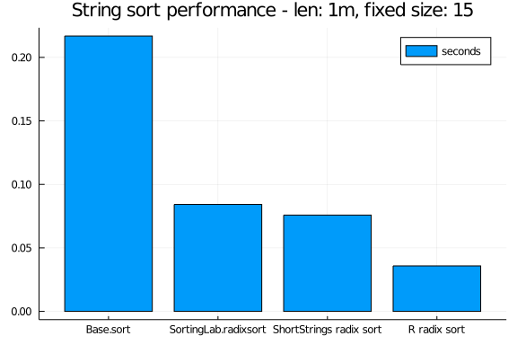

## ShortStrings
| ⚠️ Notice ⚠️ |
| --- |
| **ShortStrings.jl is deprecated** |
| [InlineStrings.jl's `InlineString`](https://github.com/JuliaData/InlineStrings.jl) is the same idea, but a more complete implementation. |
| We feel no need to duplicate efforts in the ecosystem. Moving should be pretty painless.|


This is an efficient string format for storing strings using integer types. For example, `UInt32` can hold 3 bytes of string with 1 byte to record the size of the string and a `UInt128` can hold a 15-byte string with 1 byte to record the size of the string.

Using BitIntegers.jl, integer of larger size than `UInt128` can be defined. This package supports string with up to 255 bytes in size.

## Quick Start
```julia
using ShortStrings

using SortingAlgorithms
using Random: randstring

N = Int(1e6)
svec = [randstring(rand(1:15)) for i=1:N]
# convert to ShortString
ssvec = ShortString15.(svec)

# sort short vectors
@time sort(svec);
@time sort(ssvec, by = x->x.size_content, alg=RadixSort);

# conversion to shorter strings is also possible with
ShortString7(randstring(7))
ShortString3(randstring(3))

# convenience macros are provided for writing actual strings (e.g., for comparison)
s15 = ss15"A short string"  # ShortString15 === ShortString{Int128}
s7 = ss7"shorter"           # ShortString7 === ShortString{Int64}
s3 = ss3"srt"               # ShortString3 === ShortString{Int32}

# The ShortString constructor can automatically select the shortest size that a string will fit in
ShortString("This is a long string")

# The maximum length can also be added:
ShortString("Foo", 15)

# The `ss` macro will also select the shortest size that will fit
s31 = ss"This also is a long string"
```

```
0.386383 seconds (126 allocations: 11.450 MiB, 18.62% gc time, 0.59% comp
ilation time)
  0.279547 seconds (742.26 k allocations: 74.320 MiB, 70.85% compilation ti
me)
"This also is a long string"
```


## Benchmarks

```julia
using SortingLab, ShortStrings, SortingAlgorithms, BenchmarkTools;
N = Int(1e6);
svec = [randstring(rand(1:15)) for i=1:N];
# convert to ShortString
ssvec = ShortString15.(svec);
basesort = @benchmark sort($svec)
radixsort_timings = @benchmark SortingLab.radixsort($svec)
short_radixsort = @benchmark ShortStrings.fsort($ssvec)
# another way to do sorting
sort(ssvec, by = x->x.size_content, alg=RadixSort)

using RCall
@rput svec;
r_timings = R"""
replicate($(length(short_radixsort.times)), system.time(sort(svec, method="radix"))[3])
""";

using Plots
bar(["Base.sort","SortingLab.radixsort","ShortStrings radix sort", "R radix sort"],
    mean.([basesort.times./1e9, radixsort_timings.times./1e9, short_radixsort.times./1e9, r_timings]),
    title="String sort performance - len: 1m, variable size 15",
    label = "seconds")
```


```julia
using SortingLab, ShortStrings, SortingAlgorithms, BenchmarkTools;
N = Int(1e6);
svec = rand([randstring(rand(1:15)) for i=1:N÷100],N)
# convert to ShortString
ssvec = ShortString15.(svec);
basesort = @benchmark sort($svec) samples = 5 seconds = 120
radixsort_timings = @benchmark SortingLab.radixsort($svec) samples = 5 seconds = 120
short_radixsort = @benchmark ShortStrings.fsort($ssvec) samples = 5 seconds = 120

using RCall

@rput svec;
r_timings = R"""
replicate(max(5, $(length(short_radixsort.times))), system.time(sort(svec, method="radix"))[3])
""";

using Plots
bar(["Base.sort","SortingLab.radixsort","ShortStrings radix sort", "R radix sort"],
    mean.([basesort.times./1e9, radixsort_timings.times./1e9, short_radixsort.times./1e9, r_timings]),
    title="String sort performance - len: $(N÷1_000_000)m, fixed size: 15",
    label = "seconds")
```




## Notes
This is based on the discussion [here](https://discourse.julialang.org/t/progress-towards-faster-sortperm-for-strings/8505/4?u=xiaodai). If Julia.Base adopts the hybrid representation of strings then it makes this package redundant.

# Build Status

[contrib]:     https://img.shields.io/badge/contributions-welcome-brightgreen.svg?style=flat
[travis-url]:  https://travis-ci.org/JuliaString/ShortStrings.jl
[travis-img]:  https://travis-ci.org/JuliaString/ShortStrings.jl.svg?branch=master
[codecov-url]:  https://codecov.io/gh/JuliaString/ShortStrings.jl?branch=master
[codecov-img]:  https://codecov.io/gh/JuliaString/ShortStrings.jl/branch/master/graph/badge.svg

[![contributions welcome][contrib]](https://github.com/JuliaString/Strs.jl/issues)
[![][travis-img]][travis-url]
[![][codecov-img]][codecov-url]
