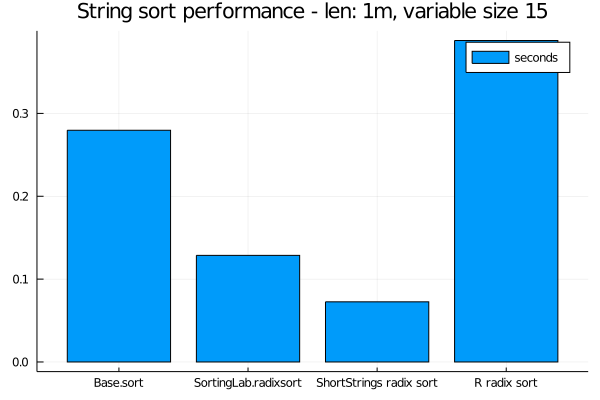

## ShortStrings
This is an efficient string format for storing strings using integer types. For example, `UInt32` can hold 3 bytes of string with 1 byte to record the size of the string and a `UInt128` can hold a byte string with 1 byte to record the size of the string.

Using BitIntegers.jl, integer of larger size than `UInt128` can be defined. This package support string with up to 126 bytes in size.

## Quick Start
````julia

using ShortStrings

using SortingAlgorithms
using Random: randstring

N = Int(1e6)
svec = [randstring(rand(1:15)) for i=1:N]
# convert to ShortString
ssvec = ShortString15.(svec)

# sort short vectors
@time sort(svec);
@time sort(ssvec, by = x->x.size_content, alg=RadixSort);

# conversion to shorter strings is also possible with
ShortString7(randstring(7))
ShortString3(randstring(3))

# convenience macros are provided for writing actual strings (e.g., for comparison)
s15 = ss15"A short string"  # ShortString15 === ShortString{Int128}
s7 = ss7"shorter"           # ShortString7 === ShortString{Int64}
s3 = ss3"srt"               # ShortString3 === ShortString{Int32}
````


````
0.305076 seconds (9 allocations: 11.445 MiB)
  0.166334 seconds (259.04 k allocations: 44.419 MiB)
"srt"
````


## Benchmarks

````julia

using SortingLab, ShortStrings, SortingAlgorithms, BenchmarkTools;
N = Int(1e6);
svec = [randstring(rand(1:15)) for i=1:N];
# convert to ShortString
ssvec = ShortString15.(svec);
basesort = @benchmark sort($svec)
radixsort_timings = @benchmark SortingLab.radixsort($svec)
short_radixsort = @benchmark ShortStrings.fsort($ssvec)
# another way to do sorting
sort(ssvec, by = x->x.size_content, alg=RadixSort)

using RCall
@rput svec;
r_timings = R"""
memory.limit(2^31-1)
replicate($(length(short_radixsort.times)), system.time(sort(svec, method="radix"))[3])
""";

using Plots
bar(["Base.sort","SortingLab.radixsort","ShortStrings radix sort", "R radix sort"],
    mean.([basesort.times./1e9, radixsort_timings.times./1e9, short_radixsort.times./1e9, r_timings]),
    title="String sort performance - len: 1m, variable size 15",
    label = "seconds")
````




````julia

using SortingLab, ShortStrings, SortingAlgorithms, BenchmarkTools;
N = Int(1e6);
svec = rand([randstring(rand(1:15)) for i=1:N÷100],N)
# convert to ShortString
ssvec = ShortString15.(svec);
basesort = @benchmark sort($svec) samples = 5 seconds = 120
radixsort_timings = @benchmark SortingLab.radixsort($svec) samples = 5 seconds = 120
short_radixsort = @benchmark ShortStrings.fsort($ssvec) samples = 5 seconds = 120

using RCall

@rput svec;
r_timings = R"""
replicate(max(5, $(length(short_radixsort.times))), system.time(sort(svec, method="radix"))[3])
""";

using Plots
bar(["Base.sort","SortingLab.radixsort","ShortStrings radix sort", "R radix sort"],
    mean.([basesort.times./1e9, radixsort_timings.times./1e9, short_radixsort.times./1e9, r_timings]),
    title="String sort performance - len: $(N÷1_000_000)m, fixed size: 15",
    label = "seconds")
````


## Notes
This is based on the discussion [here](https://discourse.julialang.org/t/progress-towards-faster-sortperm-for-strings/8505/4?u=xiaodai). If Julia.Base adopts the hybrid representation of strings then it makes this package redundant.

# Build Status

[](https://travis-ci.org/xiaodaigh/ShortStrings.jl)

[](https://coveralls.io/github/xiaodaigh/ShortStrings.jl?branch=master)

[](http://codecov.io/github/xiaodaigh/ShortStrings.jl?branch=master)
